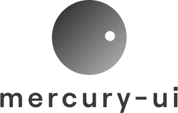

<!-- PROJECT SHIELDS -->
<!--
*** I'm using markdown "reference style" links for readability.
*** Reference links are enclosed in brackets [ ] instead of parentheses ( ).
*** See the bottom of this document for the declaration of the reference variables
*** for contributors-url, forks-url, etc. This is an optional, concise syntax you may use.
*** https://www.markdownguide.org/basic-syntax/#reference-style-links
-->
<!-- [![Contributors][contributors-shield]][contributors-url]
[![Forks][forks-shield]][forks-url]
[![Stargazers][stars-shield]][stars-url]
[![Issues][issues-shield]][issues-url]
[![MIT License][license-shield]][license-url] -->

<!-- PROJECT LOGO -->
<br />
<p align="center">
  <a href="https://github.com/nozgurozturk/mercury-ui">
    
  </a>

  <h3 align="center">mercury-ui</h3>

  <p align="center">
    Lightweigth React UI Component Library
    <br />
    <a href="https://github.com/othneildrew/Best-README-Template"><strong>Explore the docs »</strong></a>
    <br />
    <br />
    <a href="https://github.com/nozgurozturk/mercury-ui">View Demo</a>
    ·
    <a href="https://github.com/nozgurozturk/mercury-ui/issues">Report Bug</a>
    ·
    <a href="https://github.com/nozgurozturk/mercury-ui/issues">Request Feature</a>
  </p>
</p>


<!-- TABLE OF CONTENTS -->
## Table of Contents

* [About the Project](#about-the-project)
  * [Built With](#built-with)
* [Getting Started](#getting-started)
  * [Prerequisites](#prerequisites)
  * [Installation](#installation)
<!-- * [Usage](#usage)
* [Roadmap](#roadmap) -->
* [Contributing](#contributing)
* [License](#license)
* [Contact](#contact)
* [Acknowledgements](#acknowledgements)


<!-- ABOUT THE PROJECT -->
## About The Project

[![Product Name Screen Shot][product-screenshot]](https://example.com)

There are many great React UI Library accross the web, however, I didn't find one that really suit my needs so I created this enhanced one. I want to create a lightweight UI Librabry so amazing that it'll be the last one you ever need.

Here's why:

* Other libraries include highly customizable components and that's why package size is too large for e-commerce ecosystem.


You may also suggest changes by forking this repo and creating a pull request or opening an issue.

A list of commonly used resources that I find helpful are listed in the acknowledgements.

### Built With

* [React](https://reactjs.org)
* [Typescript](https://www.typescriptlang.org)
* [Sass](https://sass-lang.com)
* [Jest](https://jestjs.io)
* [React_Testing_Library](https://testing-library.com/docs/react-testing-library/intro)
* [Rollup](https://rollupjs.org/guide/en/)

<!-- GETTING STARTED -->
## Getting Started

This is an example of how you may give instructions on setting up your project locally.
To get a local copy up and running follow these simple example steps.

### Prerequisites

This is an example of how to list things you need to use the software and how to install them.
* npm
```sh
npm i react react-dom
```

### Installation

* Add to your project

```sh
npm i @nozgurozturk/mercury-ui
```
* Run with Storybook

```sh
git clone https://github.com/nozgurozturk/mercury_ui
cd mercury_ui
npm i
npm run storybook
```
<!-- USAGE EXAMPLES
## Usage

Use this space to show useful examples of how a project can be used. Additional screenshots, code examples and demos work well in this space. You may also link to more resources.

_For more examples, please refer to the [Documentation](https://example.com)_
 -->


<!-- ROADMAP 
## Roadmap

See the [open issues](https://github.com/othneildrew/Best-README-Template/issues) for a list of proposed features (and known issues).

-->
<!-- CONTRIBUTING -->
## Contributing

Contributions are what make the open source community such an amazing place to be learn, inspire, and create. Any contributions you make are **greatly appreciated**.

1. Fork the Project
2. Create your Feature Branch (`git checkout -b feature/AmazingFeature`)
3. Commit your Changes (`git commit -m 'Add some AmazingFeature'`)
4. Push to the Branch (`git push origin feature/AmazingFeature`)
5. Open a Pull Request


<!-- LICENSE -->
## License

Distributed under the MIT License. See `LICENSE` for more information.


<!-- CONTACT -->
## Contact

Ozgur Ozturk - [@nozgurozturk](https://twitter.com/nozgurozturk) - ozgur@nozgurozturk.com

Project Link: [https://github.com/nozgurozturk/mercury_ui](https://github.com/nozgurozturk/mercury_ui)


<!-- ACKNOWLEDGEMENTS -->
## Acknowledgements

* [react-select-search](https://github.com/tbleckert/react-select-search/tree/master/src)
* [Choose an Open Source License](https://choosealicense.com)
* [Readme Template](https://github.com/othneildrew/Best-README-Template)

